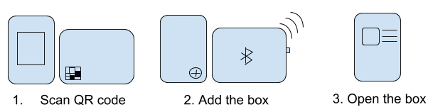

# planty-box
Application to run a hydroponic box to grow plants based on a recipe

# Getting started - User Flow

1. Scan QR code
    - the browser opens to planty.com/first_time (congratulations with your planty box, it is awesome, etc..).
    - create user or login (google).

2. Add Box
    - press the "add" button.
    - popup: to add a new box you need the Planty App (native); if on mobile then direct download link, otherwise simple instruction to install via app store.
    - open the app and login again.
    - press the "add" button.
    - popup: please select a wifi network (ssid), next is please provide the password, ok button.
    - popup: select the plantybox from the 'peripherals' list, if not visible push the button on the box (bluetooth will be enabled for 1 minute).
    - press "ok" (box will be setup with the wifi config; and iot policy will be attached to it for the user).

3. Open the box
    - see the box added to your list (in web or native app)
    - click to open (iot client will be opened to read and write shadow state).
    - push button "test" and see LED turned on, and status being updated in web and native app.